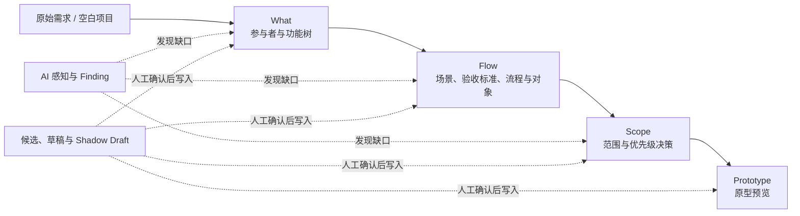

# RequirementSpace Workbench

RequirementSpace Workbench 是一个面向产品需求分析与需求空间建模的本地工作台。它将原始需求逐步整理为参与者、功能树、场景、验收标准、业务流程、业务对象、范围决策和原型预览，并通过 AI 辅助发现缺口、生成草稿和修复问题。

当前版本已经支持多用户登录、用户数据隔离、用户级 LLM 配置和公开项目标识。

## 项目愿景

传统需求文档往往把需求呈现为一份已经确定的功能清单，但真实的产品设计更接近一个仍在展开的“可能性空间”：同一个目标可能对应不同参与者、业务流程、边界取舍与实现路径，许多冲突也只有在场景、对象和验收条件被显式表达后才会浮现。

RequirementSpace Workbench 试图把这段通常散落在会议、聊天记录和个人脑海中的推理过程，转化为一个可观察、可讨论、可修订的工作空间。

> **需求文档是阶段性结果；建立、探索并收敛需求空间，才是核心过程。**

系统并不把 AI 定位为替用户直接写出“正确需求”的自动化机器，而是把它作为需求分析中的认知协作者：帮助外化隐含假设、发现结构缺口、生成备选方案、解释影响，并把最终判断留给人。

## 理论与方法论基础

RequirementSpace Workbench 的设计吸收了需求工程、认知外化、渐进式形式化和人机协同决策等思想，并将它们落实为以下原则。

### 1. 需求是空间，而不是清单

一个需求只有放入关系网络中才具有完整含义。参与者回答“谁受到影响”，功能树回答“系统提供什么能力”，场景与流程回答“事情如何发生”，业务对象回答“什么在过程中流转”，范围决策回答“当前承诺到哪里为止”。

因此，工作台保存的不只是若干独立条目，还包括条目之间的依赖、冲突、覆盖关系与阶段状态。需求分析的目标也不只是增加内容，而是逐步降低空间中的关键不确定性。

### 2. 从发散探索到约束收敛

早期需求需要允许多种解释并存，过早固定单一方案会掩盖真实分歧；但持续发散又无法形成可交付的开发边界。工作台通过候选方案、Choice Group、草稿与问题发现支持发散，再通过人工选择、验收标准、范围划分和阶段门禁推动收敛。

这个过程不是一次性的“生成—接受”，而是一个循环：

```text
表达意图 → 建立结构 → 暴露缺口 → 生成候选 → 比较影响 → 人工确认 → 更新空间
```

### 3. 渐进式形式化

模糊意图不应被迫一步变成完整规格。系统按照 **What → Flow → Scope** 逐层提高表达精度：

- **What**：确认参与者、目标、能力以及功能之间的关系。
- **Flow**：把静态能力放入场景，补充验收标准、业务流程与业务对象。
- **Scope**：在理解价值和依赖后，做出本期、暂缓与排除决策。

这种顺序允许用户先使用自然语言表达，再逐渐形成可验证、可追踪、可进入开发的结构化模型。

### 4. AI 提供建议，人保留承诺权

LLM 擅长补全、联想和生成候选，但它的输出并不天然等于事实或决策。工作台将 AI 结果放入草稿、候选组、感知槽位、修复方案或 Shadow Draft 中，先展示依据与影响，再由用户确认是否写入正式需求空间。

由此形成一条明确边界：

```text
AI 负责扩大可见范围与降低分析成本
人负责业务真实性、优先级判断与最终承诺
```

### 5. 可追踪、可预览、可回退

需求变化往往会跨越多个对象传播。工作台通过 Finding、阶段建议、影响预览、修复草稿和 Shadow Draft，让变化在正式提交前保持可见。其目标不是阻止修改，而是让用户知道“为什么改、会影响什么、确认后写入哪里”。

## 系统范围

当前实现聚焦于从模糊产品意图到结构化需求模型、范围决策和原型预览的过程，适合需要持续澄清、存在多角色或多流程、并希望保留 AI 辅助过程可控性的项目。

它不是：

- 一键生成后无需复核的 PRD 自动写作器；
- 用模型判断替代产品负责人和领域专家的决策系统；
- 完整的项目排期、工时估算或研发任务管理平台；
- 以自由聊天记录作为唯一需求载体的通用 AI 对话工具。

## 工作流概览



工作台中的阶段不是彼此隔离的页面，而是同一需求空间的不同观察尺度。前一阶段提供语义基础，后一阶段施加新的约束；Finding、NextSuggestion 与 Perception 则持续帮助用户定位当前最值得处理的缺口。

## 界面预览

以下位置已为项目截图预留。建议将正式图片统一放入 `docs/images/readme/`，并用对应的 Markdown 图片链接替换占位块。

### 1. 项目总览与阶段导航

<!-- Screenshot placeholder: docs/images/readme/01-project-overview.png -->
> 🖼️ **截图占位：项目总览**  
> 建议展示项目摘要、What / Flow / Scope 阶段导航、完成状态与当前阶段建议。

### 2. What：参与者与功能树

<!-- Screenshot placeholder: docs/images/readme/02-what-feature-tree.png -->
> 🖼️ **截图占位：What 工作区**  
> 建议展示参与者、功能树、节点关系以及右侧详情面板。

### 3. Flow：场景、验收标准与业务流程

<!-- Screenshot placeholder: docs/images/readme/03-flow-modeling.png -->
> 🖼️ **截图占位：Flow 工作区**  
> 建议展示场景列表、验收标准、流程编辑和业务对象之间的关联。

### 4. Scope：范围决策与 Kano 分析

<!-- Screenshot placeholder: docs/images/readme/04-scope-decision.png -->
> 🖼️ **截图占位：Scope 工作区**  
> 建议展示本期 / 暂缓 / 排除分组、优先级与 Kano 分析结果。

### 5. AI 感知、候选方案与问题修复

<!-- Screenshot placeholder: docs/images/readme/05-ai-perception-and-repair.png -->
> 🖼️ **截图占位：AI 协作界面**  
> 建议展示感知槽位、Finding、NextSuggestion、Choice Group 或修复草稿的预览与确认过程。

### 6. 原型预览与 Shadow Draft

<!-- Screenshot placeholder: docs/images/readme/06-prototype-shadow-draft.png -->
> 🖼️ **截图占位：原型与影响预览**  
> 建议展示原型预览、待提交变更及确认写入正式需求空间前的影响范围。

## 技术栈

- 后端：FastAPI、SQLAlchemy、SQLite/PostgreSQL、Alembic
- 前端：React 19、TypeScript、Vite、Zustand、Tailwind CSS
- AI：兼容 OpenAI Chat Completions 的 HTTP 接口
- 鉴权：服务端 Session、HttpOnly Cookie、Argon2 密码哈希
- 密钥保护：Fernet 加密普通用户保存的 LLM API Key

## 核心能力

- 从自然语言需求创建项目，或创建空白项目手动建模
- What 阶段：参与者、功能树及其关系
- Flow 阶段：场景、验收标准、业务流程和业务对象
- Scope 阶段：本期、暂缓、排除与 Kano 分析
- AI 感知、槽位补全、单对象新增和解释式编辑
- 多候选 Choice Group 生成与选择
- 问题检测、修复草稿、影响预览和阶段门禁
- 原型预览、Shadow Draft、确认提交和 Markdown/JSON 导出
- 多用户项目、草稿、会话及生成数据隔离

## 用户与 LLM 配置

系统包含两种用户角色：

| 角色 | 注册方式 | LLM 配置来源 |
|---|---|---|
| 普通用户 `user` | 直接注册，不填写邀请码 | 在“账户设置”中配置自己的 API URL、API Key 和 Model |
| 管理员 `admin` | 注册时填写正确的邀请码 | 直接使用服务器 `.env` 中的 `LLM_API_URL`、`LLM_API_KEY` 和 `LLM_MODEL_NAME` |

普通用户的 API Key 会加密后保存到数据库。接口和页面只返回 Key 的末四位，不返回明文。

### 界面语言与项目内容语言

首期支持 `zh-CN` 和 `en-US`。账户设置中的界面语言只影响当前用户看到的 UI、日期格式和本地提示；项目配置中的内容语言决定该项目后续 AI 新生成内容的语言。有效内容语言按以下顺序决议：

```text
project.content_locale > user.preferred_locale > zh-CN
```

- 项目语言为空时，AI 新内容跟随本次操作发起人的界面语言偏好。
- 项目设置语言后，无论成员使用中文还是英文界面，AI 新内容都遵守项目语言。
- 切换任何语言都不会翻译或改写已有项目内容、用户输入和历史审计记录。
- 只有项目 owner/admin 可以修改项目内容语言，其他成员只能读取。
- `observe` 模式只记录语言检测结果，原响应可能继续进入后续流程；`enforce` 模式下，模型连续两次未遵守项目内容语言时，服务端返回 `llm_content_locale_mismatch` 且不写入草稿或候选，界面会提示重试或检查当前模型的语言能力。

项目在数据库内部仍使用整数主键维护关系，但浏览器 URL、前端状态和外部 API 使用不可枚举的公开 UUID：

```text
/projects/550e8400-e29b-41d4-a716-446655440000/overview
```

不同用户无法通过公开 ID 读取或修改他人的项目及其关联资源；不存在的项目和无权访问的项目统一返回 `404`。

## 目录结构

```text
.
|-- backend/
|   |-- api/
|   |   |-- dependencies/       # 鉴权、归属校验、请求级 LLM 上下文
|   |   |-- routes/             # HTTP 路由
|   |   |-- schemas/            # Pydantic 请求与响应模型
|   |   `-- services/           # 应用服务
|   |-- core/                   # 生成器、检测器、门禁、安全工具
|   |-- database/               # SQLAlchemy 模型和数据库初始化
|   |-- integration/            # skill-backed 生成服务
|   |-- services/               # 统一 LLM 客户端
|   `-- tests/                  # 后端测试
|-- frontend/
|   |-- src/
|   |   |-- components/
|   |   |-- pages/
|   |   |-- lib/                # HTTP、鉴权和业务 API
|   |   `-- store/              # 鉴权和工作区状态
|   `-- package.json
|-- alembic/                    # 数据库迁移
|-- docs/                       # 分析、设计和实施计划
|-- .env.example
|-- requirements.txt
|-- requirements-dev.txt
`-- README.md
```

## 环境要求

- Python 3.10+，推荐 Python 3.11
- Node.js 20+
- npm 10+

## 快速开始

### 1. 安装后端依赖

PowerShell：

```powershell
python -m venv .venv
.\.venv\Scripts\python.exe -m pip install --upgrade pip
.\.venv\Scripts\python.exe -m pip install -r requirements-dev.txt
```

macOS/Linux：

```bash
python3 -m venv .venv
./.venv/bin/python -m pip install --upgrade pip
./.venv/bin/python -m pip install -r requirements-dev.txt
```

仅部署运行环境时可安装 `requirements.txt`。

### 2. 创建环境配置

```powershell
Copy-Item .env.example .env
```

macOS/Linux：

```bash
cp .env.example .env
```

必须生成独立的 LLM 配置加密密钥：

```powershell
.\.venv\Scripts\python.exe -c "from cryptography.fernet import Fernet; print(Fernet.generate_key().decode())"
```

将输出填入 `.env` 的 `LLM_CONFIG_ENCRYPTION_KEY`。该密钥一旦用于保存用户 LLM 配置，就不能随意更换或丢失，否则已有 API Key 将无法解密。

### 3. 配置管理员邀请码

先生成邀请码的 Argon2 哈希：

```powershell
.\.venv\Scripts\python.exe -c "from backend.core.security import hash_password; print(hash_password('your-invite-code'))"
```

将输出完整填入：

```env
ADMIN_INVITE_CODE_HASH=$argon2id$...
```

注册页面填写原始邀请码 `your-invite-code` 时，用户会被创建为管理员。未填写邀请码的注册始终创建普通用户。

### 4. 启动后端

```powershell
.\.venv\Scripts\python.exe -m uvicorn backend.main:app --reload --host 127.0.0.1 --port 8000
```

- 健康检查：<http://127.0.0.1:8000/api/health>
- OpenAPI：<http://127.0.0.1:8000/docs>

后端启动时会检查数据库结构并执行 Alembic。空数据库会从当前 SQLAlchemy metadata 创建完整结构；旧数据库缺少 `users` 或 `projects.public_id` 时会拒绝启动，必须按下文重置数据库。

### 5. 启动前端

```powershell
cd frontend
npm install
npm run dev
```

前端默认地址为 <http://localhost:3000>。开发服务器会把 `/api` 代理到 <http://127.0.0.1:8000>。

## 环境变量

完整模板见 [.env.example](.env.example)。

| 变量 | 必需 | 说明 |
|---|---|---|
| `DATABASE_URL` | 否 | 默认 `sqlite+aiosqlite:///./requirement_space.db`，也支持 PostgreSQL |
| `ENV` | 是 | `development` 或 `production` |
| `LLM_CONFIG_ENCRYPTION_KEY` | 是 | 加密普通用户 API Key 的 Fernet 密钥 |
| `ADMIN_INVITE_CODE_HASH` | 否 | 管理员邀请码的 Argon2 哈希；为空时不能注册管理员 |
| `AUTH_SESSION_EXPIRE_DAYS` | 否 | Session 有效天数，默认 30 |
| `AUTH_COOKIE_SECURE` | 生产必需 | 生产环境必须为 `true`，并配合 HTTPS |
| `AUTH_COOKIE_SAMESITE` | 否 | Cookie 的 SameSite 属性，默认 `lax`，跨域部署时需设为 `none` |
| `AUTH_COOKIE_DOMAIN` | 否 | Cookie 作用域名限制，默认无限制 |
| `ALLOWED_ORIGINS` | 是 | 允许携带 Cookie 的前端来源，逗号分隔 |
| `LLM_API_URL` | 管理员 AI 必需 | 管理员使用的 OpenAI 兼容服务根地址，不含 `/v1/chat/completions` |
| `LLM_API_KEY` | 管理员 AI 必需 | 管理员使用的服务器 API Key |
| `LLM_MODEL_NAME` | 管理员 AI 必需 | 管理员使用的模型名 |
| `LLM_TEMPERATURE` | 否 | LLM 采样温度 |
| `LLM_LOCALE_VALIDATION_MODE` | 否 | `observe` 仅检测并记录；`enforce` 纠正一次并拒绝持续不匹配。缺省为 `observe` |
| `REQUIREMENTSPACE_GENERATION_BACKEND` | 否 | `legacy` 或 `skill` |

普通用户不读取服务器的 `LLM_API_*`。如果普通用户尚未在账户设置中保存完整配置，AI 接口会返回 `409 llm_config_required`。

### 内容语言校验渐进发布与回退

staging 首次部署建议在 `.env` 设置 `LLM_LOCALE_VALIDATION_MODE=observe`，执行 `alembic upgrade head` 后核对历史用户 `preferred_locale=zh-CN`、历史项目 `content_locale=NULL`，再验证账户语言保存、项目语言权限和真实 LLM 请求。观察 `llm_locale_validation_completed` 的不匹配率可接受后，将模式切换为 `enforce`。

以下日志事件只包含 locale、来源、调用类型、结果、耗时和模型等元数据，不记录完整 Prompt、用户原文或模型回复：

- `llm_locale_validation_completed`：检测结果和 `observe/enforce` 模式。
- `llm_locale_correction_requested`：新增一次纠正调用。
- `llm_locale_correction_completed`：纠正成功率、额外耗时和调用计数。
- `llm_locale_validation_rejected`：最终拒绝率。

如果误判影响项目工作，将模式回退为 `observe` 并重启后端即可停止纠正和拒绝，同时保留语言决议与 Prompt 协议。不要删除语言字段、清空项目 `content_locale` 或批量改写历史数据。

## 数据库

### 本地 SQLite

默认运行文件：

```text
requirement_space.db
requirement_space.db-wal
requirement_space.db-shm
```

这些文件包含用户、项目和加密凭据，已被 Git 忽略。

当前用户鉴权与公开项目 ID 版本不提供旧数据兼容迁移。遇到旧 schema 时：

1. 停止后端。
2. 备份需要保留的数据。
3. 删除上述三个 SQLite 文件。
4. 重新启动后端。

PowerShell：

```powershell
Remove-Item requirement_space.db, requirement_space.db-wal, requirement_space.db-shm -ErrorAction SilentlyContinue
```

### PostgreSQL

通过 `DATABASE_URL` 配置连接。全新部署应使用空数据库或空 schema，启动时会创建完整结构并标记 Alembic 版本。

重置生产数据库属于破坏性操作，执行前必须备份，并确认所有应用实例已经停止。在云端 PostgreSQL 数据库（如 Neon）中，可以通过重建 `public` 架构（Schema）来进行快速重置：

```sql
DROP SCHEMA public CASCADE;
CREATE SCHEMA public;
GRANT ALL ON SCHEMA public TO public;
```

重置完成后重新启动应用，系统检测到空数据库将自动创建最新版本的完整表结构。

## 安全配置

- 密码使用 Argon2 哈希，不保存明文。
- Session Token 仅以哈希形式存入数据库。
- 登录 Cookie 为 `HttpOnly`；生产环境强制要求 `AUTH_COOKIE_SECURE=true`。
- 生产环境 `ALLOWED_ORIGINS` 必须显式配置，不能使用 `*`。
- 普通用户 LLM API Key 使用 Fernet 加密。
- 500 响应不会向客户端暴露内部异常详情，服务端日志会进行凭据脱敏。
- 项目及关联数据通过 `owner_user_id` 和当前 Session 执行归属校验。

生产环境示例：

```env
ENV=production
AUTH_COOKIE_SECURE=true
ALLOWED_ORIGINS=https://workbench.example.com
```

生产环境必须通过 HTTPS 提供前后端服务。

## 常用命令

后端：

```powershell
.\.venv\Scripts\python.exe -m pytest
.\.venv\Scripts\python.exe -m alembic upgrade head
.\.venv\Scripts\python.exe -m uvicorn backend.main:app --reload --host 127.0.0.1 --port 8000
```

前端：

```powershell
cd frontend
npm run dev
npm run lint
npm test
npm run build
npm run preview
npm run clean
```

## API 概览

- `/api/auth/register`：注册并创建 Session
- `/api/auth/login`：登录
- `/api/auth/logout`：注销并撤销 Session
- `/api/auth/me`：当前用户
- `/api/account/llm-config`：普通用户 LLM 配置查询、保存和删除
- `/api/account/llm-config/test`：测试当前或待保存的 LLM 配置
- `/api/account/preferences`：保存当前用户界面语言偏好
- `/api/projects`：当前用户的项目列表与项目操作
- `/api/projects/{project_id}/configuration`：读取或修改项目内容语言等配置
- `/api/projects/{project_id}/...`：使用公开 UUID 的项目资源接口
- `/api/*_generation_drafts`：AI 生成草稿
- `/api/projects/{project_id}/issues`：问题检测与修复
- `/api/projects/{project_id}/prototype-preview`：原型预览
- `/api/projects/{project_id}/preview-shadow-drafts`：Shadow Draft 生成与提交

以运行中的 FastAPI OpenAPI 文档为完整接口准则。

## 长耗时请求

原型和多候选生成可能持续数分钟。生产反向代理建议为 `/api` 配置至少 600 秒读取超时：

```nginx
location /api/ {
    proxy_connect_timeout 30s;
    proxy_send_timeout 600s;
    proxy_read_timeout 600s;
    proxy_pass http://127.0.0.1:8000;
}
```

Vite 本地代理已配置 `600_000` 毫秒超时。
