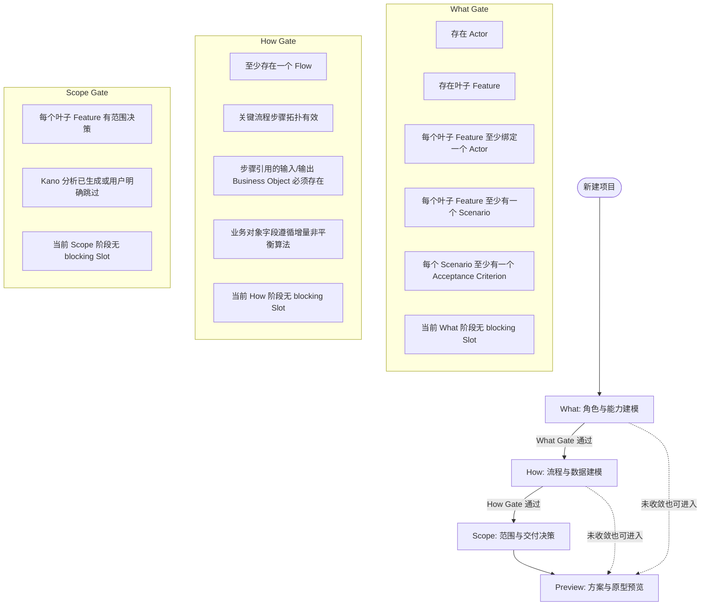

# 需求空间工作台：阶段流转、感知槽、Issue 与影子预览重构需求报告

## 1. 背景与目标

本报告用于沉淀“需求空间工作台”在页面阶段流转、感知槽导航、实时规则缺陷管理，以及 Preview 提前预览能力上的重构需求。

当前工作台已经具备从需求输入、角色与功能建模、场景与验收标准生成、流程与数据对象生成、Scope 决策到 Prototype Preview 的基本链路。但前端体验和状态约束仍存在几个核心问题：

1. 页面之间的阶段边界不够清晰，What、How、Scope 的对象和 Issue 容易互相污染。
2. 感知槽容易退化成建议列表，用户无法明确知道当前最该做哪一步。
3. Issue 检测容易在空白起步阶段就大量报警，给用户造成“刚开始就犯错”的压迫感。
4. Preview 页面既需要支持随时查看未来方案，又不能在用户未同意时把自动补全内容写入真实需求空间。

本次重构的核心目标是将工作台塑造成渐进式的人机协同产品定义工具：

- 用户在 What、How、Scope 阶段逐步建模。
- 每个阶段只看到当前阶段相关的下一步提示和 Issue。
- 起步阶段温和引导，不做僵硬报错。
- Preview 始终可访问，但未收敛项目进入“影子需求空间”预览模式，用户确认后才写回真实项目。

## 2. 核心设计原则

### 2.1 阶段隔离 Stage Isolation

工作台核心建模阶段分为：

- What 阶段：定义“要做什么”，包括 Actor、Feature、Scenario、Acceptance Criterion。
- How 阶段：定义“怎么运作”，包括 Flow、Flow Step、Business Object、Business Object Attribute。
- Scope 阶段：定义“本期交付什么”，包括每个叶子 Feature 的范围决策，以及 Kano 分析辅助依据。
- Preview 阶段：展示方案预览和原型，不再作为硬锁阶段，而是支持真实项目预览和影子项目预览两种来源。

阶段隔离要求：

- 每个页面只展示当前阶段相关 Issue。
- 每个页面只展示当前阶段相关 Perception Slot。
- 前置阶段未收敛时，后续建模页面应受到导航和路由守卫控制。
- Preview 例外：Preview 始终可进入，但未收敛时必须进入影子预览流程。

### 2.2 单点聚焦导航 Perception Slot

感知槽不是建议列表，而是当前阶段唯一的下一步行动向导。

感知槽用于回答：

> 当前用户最应该补齐哪一件事？

要求：

- 同一时刻前端主区域只展示一个 Perception Slot。
- Issue 可以有多个，但多个 Issue 只能通过优先级规则驱动出一个主导 Slot。
- 暖场 Slot 不阻塞阶段收敛。
- 阻碍性 Slot 会阻止对应阶段通过 Gate。

### 2.3 增量非平衡校验 Contextual Issue

Issue 是类似 lint 的规则缺陷提示，但不应在全空起步阶段粗暴报警。

Issue 只在“同类对象有些已完成、有些未完成”的非平衡状态下出现。

规则：

- 同类对象总数为 0：不报 Issue，生成非阻碍暖场 Slot。
- 同类对象全部缺失某子对象：不报 Issue，生成阻碍性 Slot。
- 同类对象部分有、部分没有：报具体 Issue。
- 同类对象全部满足规则：通过。

### 2.4 影子预览 Shadow Preview

Preview 页面始终可访问。当前置 What、How、Scope 未完全收敛时，系统可以自动补齐缺失内容形成一个临时的影子需求空间，并基于影子需求空间生成预览。

关键约束：

- 自动补齐内容不得直接写入真实项目。
- 影子需求空间只用于 Preview 展示。
- 用户明确确认后，影子内容才合并写回真实项目。
- 用户可以重新生成、丢弃，或只查看不采纳。

## 3. 页面流转与 Gate 规则

### 3.1 总体流转



### 3.2 What Gate

What 阶段解锁 How 阶段必须满足：

1. 至少存在一个 Actor。
2. 至少存在一个叶子 Feature。
3. 每个叶子 Feature 至少绑定一个 Actor。
4. 每个叶子 Feature 至少拥有一个 Scenario。
5. 每个 Scenario 至少拥有一个 Acceptance Criterion。
6. 当前 What 阶段不存在 `blocking === true` 的 Perception Slot。

What 阶段对象链路明确为：

```text
Actor
Feature -> Scenario -> Acceptance Criterion
Feature -> Actor binding
```

说明：

- Gate 只检查叶子 Feature 的 Scenario 完整性。
- 非叶子 Feature 作为能力分组，不强制拥有 Scenario。
- Feature 与 Actor 的绑定是 What Gate 的一等规则，不应隐含在生成逻辑中。

### 3.3 How Gate

How 阶段解锁 Scope 阶段必须满足：

1. 至少存在一个 Flow。
2. Flow Step 拓扑有效。
3. Flow Step 引用的 Actor 必须存在于 What 阶段。
4. Flow Step 引用的输入/输出 Business Object 必须真实存在。
5. Business Object Attribute 缺失遵循增量非平衡算法：
   - 若没有任何 Business Object，不报 Issue，由 Slot 判断是否需要引导创建。
   - 若所有 Business Object 都没有 Attribute，不报 Issue，但生成 `blocking: true` 的 Slot。
   - 若部分 Business Object 有 Attribute、部分没有，则对缺失者生成 Issue。
6. 当前 How 阶段不存在 `blocking === true` 的 Perception Slot。

Flow Step 拓扑有效的最低要求：

- 每个 Flow 至少有一个 Step。
- Step 的顺序或连接关系可形成可遍历链路。
- 不存在引用已删除 Step 的 next/previous 关系。
- 不存在明显孤立的中间 Step。
- 起点和终点规则需要结合当前数据结构确定；若当前模型只有线性 `position` 字段，则先按 position 有序链路校验。

### 3.4 Scope Gate

Scope 阶段不再决定 Preview 是否可访问，但决定 Preview 是否可以直接基于真实项目生成。

Scope Gate 通过条件：

1. 每个叶子 Feature 都有明确范围决策：
   - 本期包含
   - 暂缓处理
   - 排除
2. Kano 分析已生成结果，或用户明确选择跳过 Kano 分析。
3. 当前 Scope 阶段不存在 `blocking === true` 的 Perception Slot。

Scope 决策应覆盖全部叶子 Feature，而不是只覆盖当前被 Kano 返回的 Feature。

### 3.5 Preview 访问规则

Preview 页面始终可访问，不受硬锁。

Preview 根据项目收敛状态分为两种模式：

#### 真实项目预览 Real Project Preview

触发条件：

- What Gate 通过。
- How Gate 通过。
- Scope Gate 通过。

行为：

- 直接基于真实项目需求空间生成或读取 prototype preview。
- 不需要额外提醒。
- 生成结果可以正常持久化为项目的正式 preview。

#### 影子项目预览 Shadow Project Preview

触发条件：

- 用户进入 Preview 时，What、How、Scope 任一 Gate 未通过。

行为：

1. 前端提醒用户当前需求空间尚未收敛。
2. 用户选择“生成临时预览方案”。
3. 后端读取真实项目快照。
4. 后端在不写入真实项目的前提下，自动补齐缺失内容，形成 shadow snapshot。
5. 后端基于 shadow snapshot 生成 prototype preview。
6. 前端展示影子预览，并明确标识：
   - 这些补齐内容尚未写入真实项目。
   - 用户确认采纳后才写回。
7. 用户可以：
   - 采纳并写入需求空间。
   - 重新生成影子方案。
   - 丢弃影子方案。
   - 只查看预览，不写入。

## 4. Perception Slot 规格

### 4.1 Schema

```typescript
export type Stage = 'what' | 'how' | 'scope';

export interface PerceptionSlot {
  id: string;
  stage: Stage;
  blocking: boolean;
  kind: string;
  description: string;
  targetKind?: string;
  targetId?: number;
  actions: {
    manual?: {
      label: string;
      targetRoute?: string;
      targetId?: number;
      focusMode?: 'highlight' | 'modal' | 'scroll';
    };
    ai?: {
      label: string;
      endpoint?: string;
      payload?: Record<string, unknown>;
    };
  };
}
```

字段说明：

- `stage`：严格阶段归属，页面只展示当前 stage 的 Slot。
- `blocking`：是否阻塞当前阶段 Gate。
- `kind`：机器可读的槽类型，如 `missing_actor`、`missing_feature_actor_binding`、`missing_scenario`。
- `description`：面向用户的行动话术。
- `targetKind` / `targetId`：用于手动处理时定位对象。
- `actions.manual`：页面跳转、高亮、打开编辑弹窗等。
- `actions.ai`：调用 Slot 填充接口生成草稿。

### 4.2 Slot 类型建议

What 阶段：

- `what_onboarding`
- `missing_actor`
- `missing_feature`
- `missing_feature_actor_binding`
- `missing_scenario`
- `missing_acceptance_criteria`

How 阶段：

- `how_onboarding`
- `missing_flow`
- `invalid_flow_topology`
- `missing_flow_step`
- `invalid_step_actor_reference`
- `invalid_step_business_object_reference`
- `missing_business_object_attribute`

Scope 阶段：

- `scope_onboarding`
- `missing_scope_decision`
- `missing_kano_analysis`
- `kano_skipped_confirmation`

Preview 阶段不使用普通 Slot 作为 Gate，但可以在 Shadow Preview 流程中展示独立的 preview banner。

### 4.3 Slot 优先级

同一阶段可能存在多个 Issue 或多个缺口，但主 Slot 只能有一个。

推荐优先级：

1. `missing_actor`
2. `missing_feature`
3. `missing_feature_actor_binding`
4. `missing_scenario`
5. `missing_acceptance_criteria`
6. `missing_flow`
7. `invalid_flow_topology`
8. `invalid_step_actor_reference`
9. `invalid_step_business_object_reference`
10. `missing_business_object_attribute`
11. `missing_scope_decision`
12. `missing_kano_analysis`

原则：

- 先补上游基础对象，再补下游派生对象。
- 先补结构缺失，再补质量缺陷。
- Issue 多时，由最高优先级 Issue 驱动唯一 Slot。

### 4.4 暖场 Slot

暖场 Slot 只在阶段完全空白或刚进入阶段时出现。

要求：

- `blocking: false`
- 不生成 Issue。
- 只提供下一步轻量引导。

示例：

```typescript
{
  id: 'what_onboarding',
  stage: 'what',
  blocking: false,
  kind: 'what_onboarding',
  description: '欢迎进入要做什么阶段，请先创建系统参与者与核心能力。',
  actions: {
    manual: {
      label: '开始创建',
      targetRoute: '/what'
    },
    ai: {
      label: 'AI 生成角色与能力',
      endpoint: '/api/project_creation_drafts'
    }
  }
}
```

## 5. Issue 规格

### 5.1 Schema

```typescript
export interface Issue {
  id: string;
  stage: 'what' | 'how' | 'scope';
  domain:
    | 'actor'
    | 'feature'
    | 'feature_actor_binding'
    | 'scenario'
    | 'ac'
    | 'flow'
    | 'step'
    | 'business_object'
    | 'business_object_attribute'
    | 'scope_decision'
    | 'kano';
  title: string;
  description: string;
  severity: 'low' | 'medium' | 'high';
  blocking: boolean;
  relatedNodeIds: string[];
  suggestedActionKind?: string;
}
```

### 5.2 页面展示规则

- What 页面只展示 `stage === 'what'` 的 Issue。
- How 页面只展示 `stage === 'how'` 的 Issue。
- Scope 页面只展示 `stage === 'scope'` 的 Issue。
- Overview 可以展示全部 Issue，但必须按 stage 分组。
- Preview 不直接展示所有 Issue；若项目未收敛，展示 Shadow Preview 提醒和可采纳差异。

### 5.3 增量非平衡算法

通用算法：

```text
total = 同类对象总数
completed = 已满足子规则的对象数量

if total == 0:
    不报 Issue
    生成 non-blocking onboarding Slot
elif completed == 0:
    不报 Issue
    生成 blocking Slot，引导开始第一项补齐
elif completed < total:
    对未完成对象逐个生成 Issue
    由最高优先级 Issue 驱动 blocking Slot
else:
    通过
```

示例：叶子 Feature 的 Scenario 缺失

```text
leafFeatures = 5
featuresWithScenarios = 0
=> 不报 Issue，生成 blocking Slot：请为核心功能添加首个场景。

leafFeatures = 5
featuresWithScenarios = 3
=> 报 2 个 missing_scenario Issue。

leafFeatures = 5
featuresWithScenarios = 5
=> 通过。
```

示例：Business Object 的 Attribute 缺失

```text
businessObjects = 0
=> 不报 Issue，可根据上下文展示 how_onboarding 或 missing_flow Slot。

businessObjects = 3
objectsWithAttributes = 0
=> 不报 Issue，生成 blocking Slot：请为数据实体补充字段属性。

businessObjects = 3
objectsWithAttributes = 2
=> 报 1 个 missing_business_object_attribute Issue。
```

## 6. Shadow Preview 需求

### 6.1 概念定义

Shadow Preview 是 Preview 阶段的临时收敛机制。

它不是正式项目，不应在生成时创建真实 Actor、Feature、Scenario、Flow、Scope 等数据库记录。它应保存为一份可丢弃、可重生成、可提交的草稿。

影子预览包含：

- 真实项目生成时刻的 base snapshot。
- 系统补齐后的 shadow snapshot。
- 从 base 到 shadow 的 patch。
- 基于 shadow snapshot 生成的 prototype preview。

### 6.2 后端数据模型建议

新增表：`preview_shadow_drafts`

建议字段：

```text
id: int
project_id: int
draft_id: string
status: generating | ready | failed | committed | discarded
source: shadow_project
base_snapshot_json: JSON
shadow_snapshot_json: JSON
patch_json: JSON
prototype_preview_json: JSON | null
prototype_preview_id: int | null
error_message: string | null
created_at: datetime
updated_at: datetime
committed_at: datetime | null
```

说明：

- `base_snapshot_json` 用于确认生成影子草稿时真实项目的版本。
- `shadow_snapshot_json` 用于渲染 Preview。
- `patch_json` 用于用户确认后写回真实项目。
- `prototype_preview_json` 可直接存影子预览内容，避免污染正式 `prototype_previews`。
- 如果后续希望统一预览读取，也可允许 `prototype_preview_id` 指向正式预览表，但必须标记 `source='shadow'`，避免被当作真实项目最终预览。

### 6.3 影子快照结构建议

```typescript
export interface RequirementSpaceSnapshot {
  project: {
    projectId: number;
    projectName: string;
    userRequirements: string;
  };
  actors: ActorNode[];
  features: FeatureNode[];
  scenarios: ScenarioNode[];
  acceptanceCriteria: AcceptanceCriterionNode[];
  flows: FlowNode[];
  businessObjects: BusinessObjectNode[];
  scopes: ScopeDecisionNode[];
  kano?: {
    status: 'generated' | 'skipped' | 'missing';
    results?: unknown;
  };
}
```

### 6.4 Patch 结构建议

Patch 应记录影子内容相对真实项目新增或修改了什么。

```typescript
export interface ShadowPatch {
  created: {
    actors?: ActorNode[];
    features?: FeatureNode[];
    featureActorBindings?: Array<{ featureId: number | string; actorId: number | string }>;
    scenarios?: ScenarioNode[];
    acceptanceCriteria?: AcceptanceCriterionNode[];
    flows?: FlowNode[];
    businessObjects?: BusinessObjectNode[];
    scopes?: ScopeDecisionNode[];
  };
  updated: {
    features?: FeatureNode[];
    flows?: FlowNode[];
    businessObjects?: BusinessObjectNode[];
    scopes?: ScopeDecisionNode[];
  };
  metadata: {
    generatedBy: 'shadow_preview_convergence';
    generatedAt: string;
    baseProjectId: number;
  };
}
```

实现上可以先采用“完整 shadow snapshot + commit 时按 ID/临时 ID 映射写入”的方式，不必第一版就实现复杂 JSON Patch。

### 6.5 Shadow Preview API

建议新增路由前缀：

```text
/api/projects/{project_id}/preview-shadow-drafts
```

#### 创建影子预览草稿

```http
POST /api/projects/{project_id}/preview-shadow-drafts
```

请求：

```json
{
  "force_regenerate": false
}
```

响应：

```json
{
  "draft_id": "shadow_xxx",
  "project_id": 1,
  "source": "shadow_project",
  "status": "ready",
  "unready_gates": ["what", "how"],
  "shadow_summary": {
    "created_actor_count": 2,
    "created_scenario_count": 5,
    "created_flow_count": 1
  },
  "prototype_preview": {
    "pages": []
  }
}
```

如果真实项目已经收敛，后端也可以返回：

```json
{
  "source": "real_project",
  "status": "ready",
  "prototype_preview": {}
}
```

#### 查询影子草稿

```http
GET /api/projects/{project_id}/preview-shadow-drafts/{draft_id}
```

#### 重新生成影子草稿

```http
POST /api/projects/{project_id}/preview-shadow-drafts/{draft_id}/regenerate
```

#### 提交影子草稿

```http
POST /api/projects/{project_id}/preview-shadow-drafts/{draft_id}/commit
```

提交行为：

1. 校验 draft 状态为 `ready`。
2. 校验真实项目与 base snapshot 是否存在严重冲突。
3. 将 patch 写入真实项目数据库。
4. 标记 draft 为 `committed`。
5. 使相关 perception jobs / issue cache 失效。
6. 返回真实项目刷新后的 workspace 数据。

#### 丢弃影子草稿

```http
DELETE /api/projects/{project_id}/preview-shadow-drafts/{draft_id}
```

### 6.6 Shadow Convergence Service

建议新增：

```text
backend/api/services/preview_shadow_convergence_service.py
```

职责：

1. 读取真实项目并构建 `base_snapshot`。
2. 调用 Gate evaluator 判断 What、How、Scope 未收敛项。
3. 针对缺口调用对应生成服务，但只使用 draft payload，不 confirm。
4. 将生成结果合并进 `shadow_snapshot`。
5. 基于 `shadow_snapshot` 调用 prototype generator。
6. 保存 shadow draft。
7. 在 commit 时将 patch 写入真实项目。

重要约束：

- Shadow convergence 不应调用现有服务的 `confirm_draft`。
- Shadow convergence 不应直接向真实表插入 Actor、Feature、Scenario 等正式记录。
- 生成器最好拆出“纯生成 payload”和“持久化 confirm”两个层次，避免重复逻辑。

### 6.7 影子补齐顺序

当项目未收敛时，建议按以下顺序补齐 shadow snapshot：

1. What 基础：
   - Actor
   - Feature
   - Feature-Actor binding
   - Scenario
   - Acceptance Criteria
2. How 基础：
   - Flow
   - Flow Step
   - Business Object
   - Business Object Attribute
3. Scope 基础：
   - Kano 分析或跳过标记
   - Scope decision
4. Prototype：
   - 按角色与 Feature 页面生成原型预览。

此顺序与真实项目 Gate 保持一致。

## 7. 前端改造需求

### 7.1 Selector 重构

目标文件：

```text
frontend/src/core/selectors.ts
```

需要新增或重构：

- `buildStageGate(space, stage)`
- `buildWhatGate(space)`
- `buildHowGate(space)`
- `buildScopeGate(space)`
- `detectStageIssues(space, stage)`
- `buildSinglePerceptionSlot(space, stage, issues)`
- `buildPageHealth(space, path)`
- `buildOverviewModel(space)`

Page Health 应基于 Gate，而不是简单 issue count。

建议返回：

```typescript
interface StageGateResult {
  stage: 'what' | 'how' | 'scope';
  passed: boolean;
  blockingSlot?: PerceptionSlot;
  issues: Issue[];
  missingKinds: string[];
}
```

### 7.2 路由守卫

需要改造：

- LeftNav：显示 disabled、原因、下一步按钮。
- App Router：阻止直接通过 URL 访问受限页面。

守卫规则：

- 未通过 What Gate：禁止进入 `/flow`、`/scope`。
- 未通过 How Gate：禁止进入 `/scope`。
- `/preview` 始终允许进入。
- `/preview` 若 Gate 未全部通过，则进入 Shadow Preview 提醒流程。

### 7.3 What 页交互补全

目标文件：

```text
frontend/src/pages/WhatToDo.tsx
frontend/src/components/shared/RightObjectPanel.tsx
```

需求：

- Feature 编辑面板增加 Actor 多选绑定。
- 支持绑定/解绑 Actor。
- 保存后调用 `updateFeature` 或新增专门绑定接口。
- Feature 卡片上展示当前绑定 Actor。
- 叶子 Feature 无 Actor 时，应能通过 Slot 手动定位到该 Feature。

### 7.4 How 页交互补全

目标文件：

```text
frontend/src/pages/HowItWorks.tsx
frontend/src/store/useWorkspaceStore.ts
```

需求：

- 新增自定义 Flow。
- 新增 Flow Step。
- 编辑 Flow Step：
  - 名称
  - 描述
  - 涉及 Actor
  - 输入 Business Object
  - 输出 Business Object
  - 位置或前后链路
- 删除 Flow Step。
- 调整 Step 顺序或拓扑关系。
- 新增/编辑/删除 Business Object。
- 新增/编辑/删除 Business Object Attribute。

### 7.5 Scope 页改造

目标文件：

```text
frontend/src/pages/ScopeAndDelivery.tsx
```

需求：

- 每个叶子 Feature 必须有范围决策状态。
- Kano 分析结果入口必须清晰展示。
- 展示内容与后端能力一致：
  - 正向满意度分布柱状图
  - 反向满意度分布柱状图
  - Kano 分类
  - Better/Worse
  - 正反方依据摘要
- 支持“跳过 Kano 分析”，但必须有明确用户动作记录。

### 7.6 Preview 页改造

目标文件：

```text
frontend/src/pages/Preview.tsx
```

需求：

- 页面始终可访问。
- 加载时先查询 Gate 状态或调用 preview prepare 接口。
- 若真实项目已收敛：
  - 直接展示真实 prototype preview。
- 若未收敛：
  - 展示 Shadow Preview 提醒。
  - 用户确认后创建 shadow draft。
  - 展示 shadow prototype iframe。
  - 展示 shadow diff summary。
  - 提供按钮：
    - 采纳并写入需求空间
    - 重新生成影子方案
    - 丢弃影子方案
    - 仅查看

## 8. 后端改造需求

### 8.1 Gate Evaluator

建议新增：

```text
backend/api/services/stage_gate_service.py
```

职责：

- 读取项目聚合数据。
- 评估 What、How、Scope Gate。
- 返回 issues、slot、passed、missing kinds。

该服务应尽量复用前端 selector 的规则语义，避免前后端判断分裂。

### 8.2 Issue Service

如果后端已有 perception jobs / issue resolver，可在其上收敛字段；否则新增统一 issue builder。

需要支持：

- `stage`
- `domain`
- `blocking`
- `relatedNodeIds`
- `suggestedActionKind`

### 8.3 Slot Service

Slot 由 Issue 和空白状态共同驱动。

职责：

- 接收 stage gate result。
- 根据优先级生成唯一 slot。
- 暖场状态生成 non-blocking onboarding slot。
- 支持 AI action endpoint 生成。

### 8.4 Shadow Preview Service

详见第 6 节。

该服务是 Preview 提前访问能力的核心，不应与真实项目持久化耦合。

### 8.5 Prototype Generator 适配

当前 prototype generator 应支持两类输入：

1. 真实项目 ID：从数据库读取真实需求空间。
2. Shadow snapshot：从 JSON 快照读取临时需求空间。

建议抽象：

```python
class PrototypeGenerationInput:
    source: Literal["project", "snapshot"]
    project_id: int | None
    snapshot: dict | None
```

这样 Preview 页可以复用同一套原型生成能力。

## 9. 数据一致性与提交策略

### 9.1 Shadow Commit 原则

用户点击“采纳并写入需求空间”时，后端应执行事务：

1. 加载 shadow draft。
2. 校验 draft 未提交、未丢弃。
3. 校验 base snapshot 与当前真实项目是否冲突。
4. 写入新增或更新的对象。
5. 建立临时 ID 到真实 ID 的映射。
6. 修复对象之间的引用关系。
7. 刷新 Issue / Slot / Scope / Prototype 相关缓存。
8. 返回最新项目聚合数据。

### 9.2 冲突处理

第一版可以采用保守策略：

- 如果 shadow draft 生成后，真实项目发生结构性变化，则 commit 返回 `shadow_draft_conflict`。
- 前端提示用户重新生成影子方案。

结构性变化包括：

- Actor、Feature、Scenario、Flow、Business Object 数量变化。
- 关键对象被删除。
- Scope 决策变化。

后续可以升级为细粒度 merge。

### 9.3 临时 ID 策略

Shadow snapshot 中新增对象可使用字符串临时 ID：

```text
tmp_actor_1
tmp_feature_1
tmp_scenario_1
tmp_flow_1
```

commit 时建立：

```text
tmp_id -> real_db_id
```

所有引用关系在写入真实数据库后重映射。

## 10. 推荐实施顺序

### P0：规格与数据结构

1. 固化 Stage、Issue、PerceptionSlot schema。
2. 明确 What、How、Scope Gate。
3. 明确 Preview shadow draft 数据模型。

### P1：Selector 与前端 Gate

1. 重构 `selectors.ts`。
2. 实现增量非平衡 Issue。
3. 实现唯一 Slot。
4. 改造 LeftNav 和 Router Guard。
5. 保持 Preview 始终可访问。

### P2：What 闭环补齐

1. Feature-Actor 手动绑定 UI。
2. Slot 手动定位到 Feature。
3. What Gate 联调。

### P3：How 手动编辑补齐

1. Flow 手动创建。
2. Step 手动增删改。
3. Step 拓扑或顺序调整。
4. Business Object 和 Attribute 增删改。
5. How Gate 联调。

### P4：Scope 决策与 Kano 展示

1. 全叶子 Feature 范围决策。
2. Kano 分析生成/跳过状态。
3. Kano 图表与依据展示。
4. Scope Gate 联调。

### P5：Shadow Preview

1. 新增 shadow draft 表和 API。
2. 新增 shadow convergence service。
3. Prototype generator 支持 snapshot 输入。
4. Preview 页支持 shadow 提醒、生成、展示、采纳、丢弃。
5. Shadow commit 写回真实项目。

## 11. 验收标准

### 11.1 阶段隔离

- What 页面不展示 How / Scope Issue。
- How 页面不展示 What / Scope Issue。
- Scope 页面不展示 What / How Issue。
- Overview 可汇总，但必须分 stage。

### 11.2 单点感知槽

- 每个阶段主区域最多展示一个 Slot。
- 空白阶段展示 non-blocking onboarding Slot。
- 全缺失状态展示 blocking Slot，不报 Issue。
- 非平衡状态展示 Issue，并由最高优先级 Issue 生成唯一 Slot。

### 11.3 Gate

- What Gate 未通过时，无法进入 How 和 Scope。
- How Gate 未通过时，无法进入 Scope。
- Preview 始终可进入。
- Preview 在 Gate 未全部通过时，不直接写入真实项目。

### 11.4 Shadow Preview

- 未收敛项目进入 Preview 时，系统提示影子模式。
- 影子补齐内容在用户确认前不写入真实数据库。
- 用户丢弃 shadow draft 后，真实项目无变化。
- 用户 commit shadow draft 后，真实项目包含影子补齐内容。
- commit 后 Issue / Slot 状态重新计算。

### 11.5 Kano 与 Scope

- 每个叶子 Feature 都能设置范围决策。
- Kano 图表展示与后端能力一致。
- 用户可明确跳过 Kano。
- Scope Gate 能识别“未决策”和“Kano 未闭环”状态。

## 12. 非目标

以下内容不作为本次重构第一阶段目标：

- 多用户实时协同合并。
- 复杂 JSON Patch 三方 merge。
- 完整 BPMN 级流程编辑器。
- Kano 雷达图，除非后端明确提供相应维度数据。
- Preview 影子项目与真实项目的自动无冲突合并智能决策。

## 13. 最终结论

本重构将工作台从“页面堆叠式 AI 生成工具”升级为“阶段化、可导航、可试看的需求空间建模系统”。

核心落点是：

- What、How、Scope 有清晰 Gate。
- Issue 做阶段隔离和增量非平衡校验。
- Slot 始终是唯一下一步，而不是建议列表。
- Preview 始终可访问，但通过 Shadow Preview 避免污染真实项目。
- 用户拥有最终写入真实需求空间的确认权。

后续所有相关前端界面改造、Store 状态流转、后端 API、生成服务编排和数据层设计，均应以本报告定义的阶段边界、Schema、Gate、Issue 算法与 Shadow Preview 机制为准。
