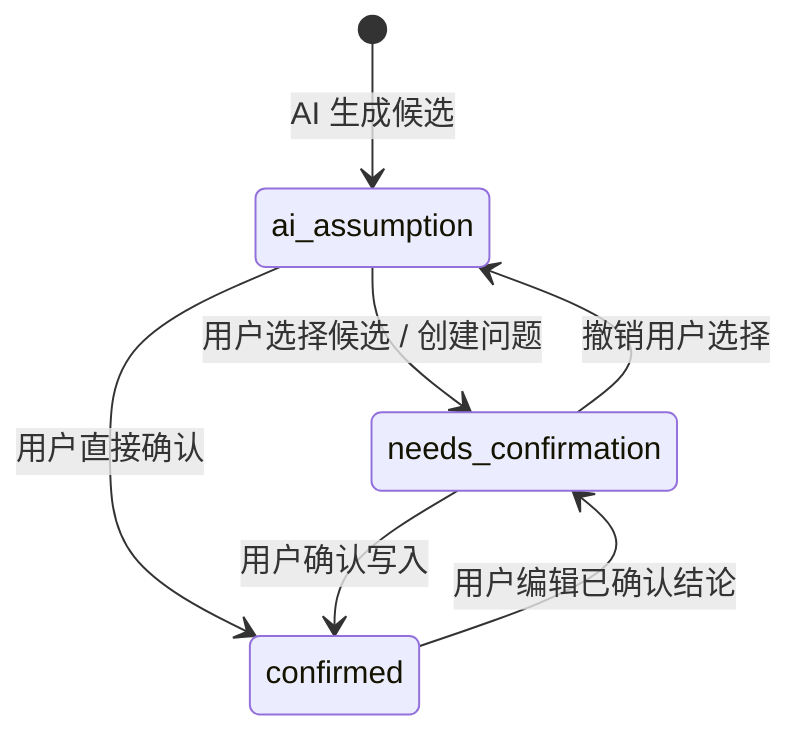
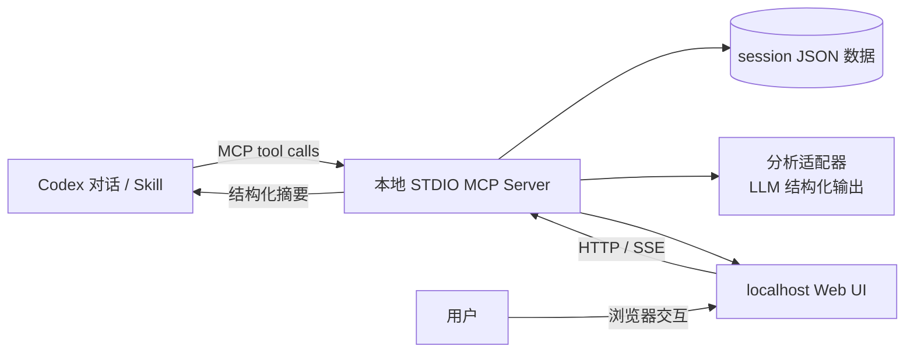

# Requirement Space Fog：Codex MCP 插件极简版设计方案

> 状态：设计提案  
> 目标载体：Codex desktop plugin（优先）+ 本地 MCP 服务 + 本地网页  
> 非目标：复刻 RequirementSpace Workbench 的完整 What / Flow / Scope 工作台

## 1. 结论与产品定位

建议实现一个名为 **Requirement Space Fog** 的 Codex 插件。它不是“把一句需求自动写成 PRD”的助手，也不是原工作台的缩小版页面；它是一个把模糊意图转成**可观察、可讨论、可收敛的小型需求空间**的分析工具。

用户在 Codex 中说出一段意图，例如“做一个供团队提交和审批报销的工具”。插件以 MCP 工具创建一个本地分析会话，AI 将意图外化为少量候选节点与关系，并把未被证实的关键部分显式标为迷雾（unknown）。用户在本地网页或对话中确认、选择、修改或暂缓这些迷雾，空间随之更新。

最终演示的不是“AI 很会提问”，而是下面这条工作台核心闭环：

```text
模糊意图
  -> 外化候选结构
  -> 暴露结构缺口、冲突与未决边界
  -> 生成可比较的候选与澄清问题
  -> 人确认、选择或暂缓
  -> 需求空间收敛，关键不确定性降低
```

这个切面足以展示“保持内核基因，外壳交互方式竞争”：同一个空间模型和收敛规则既能由 Codex 对话驱动，也能由浏览器卡片交互驱动；未来可由 Claude Code 的 MCP/CLI 外壳复用。

## 2. 必须保留的工作台内核

| 内核理念 | 极简版的可见证据 | 不做会退化成什么 |
| --- | --- | --- |
| 需求是空间，不是清单 | 节点与关系图；每个 unknown 指向节点、关系或边界 | PRD 生成器 |
| 先发散、再收敛 | AI 可给候选解释；用户明确选择或保留未决 | 单答案问答机器人 |
| 渐进式形式化 | 只从意图到最小 `What -> Flow -> Scope` 投影，不强迫一次写全 | 生硬的表单建模器 |
| AI 提议，人保留承诺权 | AI 输出不能直接成为 confirmed；状态和依据始终可见 | 自动决策器 |
| 迷雾是可感知的缺口 | 迷雾按类型、影响、置信度、阻塞范围展示并排序 | 普通待办清单 |
| 可追踪与可回退 | 每次决策记录前后差异；可撤销最近一次决策 | 一次性聊天记录 |

### 2.1 最小领域投影

完整工作台中的对象很多；演示版只保留能证明“关系空间”成立的五类对象：

| 类型 | 语义 | 例子 |
| --- | --- | --- |
| `actor` | 谁受到影响或发起行动 | 报销员工、审批人 |
| `capability` | 系统提供的能力 | 提交报销、审批报销 |
| `scenario` | 能力在什么情境下发生 | 员工提交一笔跨币种报销 |
| `scope_decision` | 本期是否承诺、暂缓或排除 | 跨币种报销：暂缓 |
| `unknown` | 空间中的未决事实、关系、选择或边界 | 审批额度规则未知 |

关系限为 `uses`、`enables`、`occurs_in`、`constrains`、`conflicts_with`、`depends_on` 六种。首版每个会话限制 3–8 个结构节点、3–6 个 unknown，保持“极简”与可读性。

### 2.2 Unknown 不是通用问题

每个 unknown 必须有精确落点：

```json
{
  "id": "u-approval-policy",
  "kind": "business_rule",
  "statement": "不同金额的报销由谁审批尚未确定",
  "affects": ["capability:approve-expense", "scenario:expense-submission"],
  "impact": "high",
  "confidence": 0.18,
  "status": "ai_assumption",
  "options": [
    {"id": "single", "label": "统一由直属经理审批"},
    {"id": "tiered", "label": "按金额分级审批"}
  ],
  "question": "本期是否存在按金额分级的审批规则？"
}
```

`affects` 是核心约束：没有受影响节点或关系的 unknown 不应进入空间，而应被丢弃或改写为结构化缺口。

## 3. 用户体验与演示脚本

### 3.1 90 秒演示

1. 在 Codex 输入：“使用 requirement-space-fog 分析：我们想做一个团队报销工具，员工拍照上传票据，主管审核后财务打款。”
2. Codex 调用 `create_space` 和 `analyze_intent`，回复一段简短摘要，并打开本地工作区。
3. 网页显示：两个 actor、三项 capability、一个主场景以及 4 个带颜色的迷雾；连线明确显示“审批规则未知”影响审批能力和提交场景。
4. 用户打开该迷雾，看到两个候选和影响预览，选择“按金额分级审批”。
5. 页面动画将该项从 `ai_assumption` 移到 `needs_confirmation`；用户点击“确认写入空间”，它变为 `confirmed`，并生成相应的 `business_rule` 节点与关联。
6. 顶部“迷雾指数”下降；仍未解决的“打款方式”和“票据合规范围”保留为可见风险。

关键话术：**不是 AI 替用户决定了审批规则；AI 让此前隐含、会影响多个地方的选择变得可见并可比较。**

### 3.2 本地网页信息架构

单页，不做多路由：

```text
┌─────────────────────────────────────────────────────────────┐
│ 意图摘要 | 迷雾指数 62 -> 39 | 已确认 1 / 待确认 2 / AI 假设 1 │
├──────────────────────────────┬──────────────────────────────┤
│ 需求空间（节点、连线、迷雾） │ 当前迷雾详情                 │
│                              │ - 影响：审批、提交场景       │
│  员工 -> 提交报销 -> 提交场景 │ - 候选 A / B                 │
│               ^              │ - 依据与置信度               │
│           [审批规则？]       │ [选择] [编辑] [暂缓] [确认] │
│               v              │                              │
│          审批报销 <- 主管    │                              │
├──────────────────────────────┴──────────────────────────────┤
│ 决策时间线：AI 提议 -> 用户选择 -> 用户确认；可撤销最后一步   │
└─────────────────────────────────────────────────────────────┘
```

视觉规则：confirmed 为实线/高饱和，needs_confirmation 为琥珀色，ai_assumption 为紫灰虚线；unknown 不是孤立卡片，而是悬挂在受影响边或节点旁。颜色之外必须有文字标签，避免只靠颜色表达状态。

## 4. 状态机与收敛规则

### 4.1 唯一的承诺状态机

沿用工作台既有 `confirmation_status`，不另造一套“已解决”状态：



`confirmed` 代表人已承诺其真实性或范围，而非“客观永远正确”。用户编辑 confirmed 内容后，必须回到 `needs_confirmation`，且保留旧版本在决策记录里。

### 4.2 Unknown 的处理动作

| 动作 | 空间变化 | 何时可用 |
| --- | --- | --- |
| 选择候选 | 写入选择草稿，unknown -> `needs_confirmation` | 有可比较候选 |
| 编辑结论 | 用用户文本替换/新建候选，-> `needs_confirmation` | AI 候选不合适 |
| 确认 | 将结论物化为节点或关系，-> `confirmed` | 用户已明确承诺 |
| 暂缓 | 生成 `scope_decision: postponed`，unknown 保留并降低本期阻塞权重 | 不影响当前演示目标 |
| 驳回 | 删除 AI 假设，写入“已排除原因”审计事件 | 该问题不成立 |
| 撤销 | 回放上一个不可逆写操作之前的快照 | 演示和试错 |

### 4.3 迷雾指数

指数不是精确的“需求完成度”，只用于可视化不确定性的相对变化：

```text
fog_score = Σ unknown.weight
unknown.weight = impact_weight × (1 - confidence) × active_scope_weight
```

- `impact_weight`：high=3、medium=2、low=1；
- `active_scope_weight`：本期=1，暂缓=0.35，排除=0；
- confirmed unknown 不再计入；
- 首页标注“相对迷雾，不代表需求已完成”，避免虚假的量化承诺。

## 5. Codex 插件与 MCP 的实际落地

### 5.1 推荐形态：插件包 + 本地 STDIO MCP + 本地浏览器 UI

首版选本地 STDIO MCP：安装插件后，Codex 启动本地进程并调用其工具。MCP 服务负责真实状态和文件持久化；网页只是同一服务暴露的 localhost 界面。这样不依赖外部托管、登录或 API Key，也便于离线演示。



这不是把网页“塞进 MCP”。MCP 是工具与状态边界；网页通过 localhost HTTP 读取和修改同一会话。`open_workspace` 工具负责启动/复用 Web 服务并返回本地 URL，Codex 可将其呈现为可点击链接或按宿主能力打开。

### 5.2 嵌入式 UI 是第二阶段，不是首版前提

如果目标是让页面直接嵌入 ChatGPT/Codex desktop 的插件界面，应另行实现 Apps SDK MCP UI resource，并在 ChatGPT Developer Mode 注册 MCP-backed app，再用 `plugin_asdk_app...` 绑定插件。它适合长期分发，但引入开发模式、App ID 和宿主兼容性验证。

两种模式共用服务层、领域模型、工具 schema 和前端组件；不同之处只在 UI transport：

| 模式 | 首版建议 | 优点 | 成本/限制 |
| --- | --- | --- | --- |
| localhost 网页 | 是 | 最稳、零远端依赖、可立即演示 | 非宿主内嵌；需浏览器打开 |
| Apps SDK 嵌入 UI | 后续 | 原生地在 ChatGPT/Codex 桌面插件内交互 | 需 Developer Mode / app 注册与兼容性测试 |
| 纯 Skill | 兼容出口 | Claude Code、Codex CLI 都可复用对话工作流 | 无图形空间视图 |

### 5.3 建议目录

```text
plugin/
├─ .codex-plugin/
│  └─ plugin.json                # 插件清单：name、version、skills、mcp_servers
├─ .mcp.json                      # 或 manifest 内声明的 MCP server 配置
├─ skills/
│  └─ requirement-space-fog/
│     └─ SKILL.md                 # 触发词、对话编排与人类承诺边界
├─ server/
│  ├─ src/
│  │  ├─ index.ts                 # STDIO MCP bootstrap
│  │  ├─ tools.ts                 # MCP tool 注册与 schema
│  │  ├─ domain/                  # Space、Node、Edge、Unknown、Decision
│  │  ├─ services/                # analyze、resolve、snapshot、fog score
│  │  ├─ storage/                 # session JSON repository
│  │  └─ web.ts                   # localhost HTTP + SSE
│  └─ package.json
├─ web/
│  ├─ src/                        # React/Vite 单页
│  └─ dist/                       # 构建产物（发布时纳入包）
├─ examples/
│  └─ expense-demo.json
└─ docs/
   └─ requirement-space-fog-plugin-design.md
```

实际清单字段以创建时的最新版 `@plugin-creator` 输出为准。首版不应手写假定的 `mcp_servers` manifest schema；先由官方脚手架生成清单和个人 marketplace 条目，再将服务命令、Skill 和构建产物填入。

## 6. MCP 工具设计

工具名要反映业务动作而非 UI 动作；每个写工具都应返回完整的 `space_summary` 和增量 `changes`，让 Codex 能解释“这次确认改变了什么”。

| 工具 | 读写 | 输入 | 输出 | 安全注解 |
| --- | --- | --- | --- | --- |
| `create_space` | 写 | `intent`, `title?` | `space_id`, 空间摘要 | 非破坏性写入 |
| `analyze_intent` | 写 | `space_id`, `intent?` | 节点、关系、unknown、依据 | 非破坏性写入；AI 草稿 |
| `get_space` | 读 | `space_id` | 完整快照、迷雾指数 | `readOnlyHint: true` |
| `list_unknowns` | 读 | `space_id`, `status?`, `impact?` | 排序后的 unknown | `readOnlyHint: true` |
| `resolve_unknown` | 写 | `unknown_id`, `action`, `option_id?`, `text?` | 状态变化、空间 diff | `destructiveHint: false` |
| `confirm_change` | 写 | `space_id`, `change_id` | confirmed 节点/边、审计事件 | 明确提示用户承诺 |
| `undo_last_decision` | 写 | `space_id` | 回退后的摘要 | 明确影响范围 |
| `open_workspace` | 本地副作用 | `space_id` | URL、服务状态 | 仅开本机浏览器/链接 |
| `export_space` | 读 | `space_id`, `format` | Markdown / JSON 路径或内容 | `readOnlyHint: true` |

### 6.1 `resolve_unknown` 的输入约束

```ts
type ResolveAction = "select_option" | "edit" | "postpone" | "reject";

type ResolveUnknownInput = {
  space_id: string;
  unknown_id: string;
  action: ResolveAction;
  option_id?: string; // select_option 必填
  text?: string;      // edit/reject 的理由或内容
};
```

- 不允许客户端直接提交 `status: confirmed`；确认必须走 `confirm_change`。
- `postpone` 必须要求一个简短理由，形成范围决策。
- `reject` 必须保留被拒绝的 AI 假设与理由，保证“AI 可错”可见。

### 6.2 工具调用的对话编排

Skill 只定义何时调用工具和如何陈述结果，不保存业务真相：

1. 用户给出意图：`create_space` -> `analyze_intent` -> `open_workspace`。
2. Codex 只总结“目前空间有什么、最关键的 1–2 个迷雾是什么、它们影响哪里”。
3. 用户回答或点击页面：`resolve_unknown`。
4. 用户说“确认”：`confirm_change`；Codex 必须陈述本次写入的节点/关系与仍保留的风险。
5. 用户问“还有什么不清楚”：`list_unknowns`，按影响和活跃范围排序。

禁止 Skill 直接把模型推断描述为用户结论；工具的 `status` 是最终约束。

## 7. 分析引擎设计

### 7.1 输入输出契约

分析器由 LLM 实现时，必须使用结构化输出并通过 JSON Schema 校验。输出不是最终需求，而是 `proposal`：

```ts
type AnalysisProposal = {
  summary: string;
  nodes: DraftNode[];       // 每个默认 ai_assumption
  edges: DraftEdge[];
  unknowns: DraftUnknown[]; // 均有 affects、reason、question
  omitted_assumptions: string[];
};
```

确定性服务层负责：ID、状态初始化、关系合法性、unknown 是否真有 `affects`、迷雾排序、事件记录、持久化。不要让 LLM 直接访问 session JSON 或直接写数据。

### 7.2 Unknown 分类

| `kind` | 识别信号 | 例子 |
| --- | --- | --- |
| `actor` | 使用者、责任者或权限主体未定 | 谁能最终打款？ |
| `goal` | 成功标准或价值未定 | 用户何时认为报销完成？ |
| `business_rule` | 条件、阈值、审批规则未定 | 金额如何分级审批？ |
| `scope` | 本期/暂缓/排除边界未定 | 是否支持跨币种？ |
| `data_object` | 关键对象、字段、归属未定 | 发票原件是否保存？ |
| `flow` | 顺序、异常或触发条件未定 | 审批被拒后如何处理？ |
| `conflict` | 两条候选无法同时成立 | 即时打款与人工复核冲突 |

优先识别“会改变关系或边界”的 unknown，避免收集文案、视觉风格等不影响需求空间收敛的细节。

### 7.3 提示词原则

系统提示应以规则而不是长篇角色扮演为主：

- 只提取输入明确支持的节点；其余以 `ai_assumption` 表达。
- 每个 unknown 必须说明影响对象、未决原因和一个可回答的问题。
- 不得用“需要更多信息”作为 unknown；必须具体化为事实、规则、范围或冲突。
- 最多输出 6 个 unknown；按影响优先级筛选。
- 候选最多 3 个；仅在确有多种合理解释时给出。
- 不编造法律、合规、成本、组织结构等领域事实。

## 8. 数据、事件与可回退

### 8.1 会话存储

首版持久化为一个本地 JSON 文件：`<workspace>/.requirement-space-fog/<space-id>.json`。这既便于展示“模型独立于 UI”，也避免接入现有工作台数据库的耦合。

```json
{
  "schema_version": 1,
  "space": {"id": "...", "title": "团队报销", "intent": "..."},
  "nodes": [],
  "edges": [],
  "unknowns": [],
  "changes": [],
  "events": [],
  "snapshots": []
}
```

所有写操作附加 append-only event；关键写操作前生成轻量快照。`undo_last_decision` 只允许撤销当前会话的最近一次决策，避免首版处理任意历史分支。

### 8.2 事件类型

`space_created`、`analysis_proposed`、`unknown_resolved`、`change_confirmed`、`scope_postponed`、`assumption_rejected`、`decision_undone`。

事件是页面底部时间线的唯一数据源；不要由 UI 自行拼装历史文案。

## 9. 安全、隐私与边界

- 默认本地运行，分析数据不上传到插件作者服务；若接入模型 API，UI 明示使用的模型提供方和输入会发送到哪里。
- 无用户认证、无多用户协作、无远程同步；这些属于后续产品化范围。
- MCP 工具严格区分 read/write；写操作用准确的风险 metadata，并保持“确认”独立于“选择候选”。
- 本地 HTTP 只监听 `127.0.0.1`，使用随机端口和随机会话令牌；不暴露局域网访问。
- `open_workspace` 不接受任意 URL、任意命令或任意文件路径。
- 浏览器 UI 调用写接口时传递 session token；服务端验证 `space_id` 属于当前 workspace。
- 不读取现有 RequirementSpace Workbench 的数据库，也不改动其源码；两者只共享概念，不共享运行时状态。

## 10. 实施切分与验收

### P0：可跑通的内核（一天内可完成的最小切片）

- 领域模型、JSON repository、迷雾指数、事件记录。
- STDIO MCP 服务的 `create_space`、`analyze_intent`、`get_space`、`resolve_unknown`。
- 使用固定 fixture 模拟分析结果，先验证状态机和空间变化。

**验收：**对报销示例能创建 3 个节点、3 个 unknown；选择候选后状态为 `needs_confirmation`；确认后新增/更新对应节点或关系。

### P1：本地演示页

- 单页空间图、unknown 详情抽屉、状态标签、决策时间线。
- `open_workspace`、HTTP API、SSE 刷新。
- `postpone`、`reject`、`undo_last_decision`。

**验收：**用户在网页确认审批规则后，图、迷雾指数、时间线和 Codex `get_space` 返回值一致。

### P2：真实 AI 分析与评估

- 接入结构化输出分析适配器。
- 添加 10–15 条中文模糊需求 fixture 与期望 unknown 类型。
- 对错误：无受影响对象、过度拆解、把 AI 假设标成 confirmed、漏掉高影响范围问题进行回归测试。

**验收：**所有 fixture 都满足 schema；0 个 AI 生成节点初始为 confirmed；每个 unknown 有 `affects` 且能生成一个具体澄清问题。

### P3：作为真正插件安装与 Apps SDK 评估

- 用 `@plugin-creator` 生成 `.codex-plugin/plugin.json` 和 repo marketplace 条目。
- 在 Codex desktop 重启后安装、创建新任务、验证插件可发现和 MCP 可启动。
- 评估是否将 localhost 页面替换/补充为 Apps SDK 嵌入 UI；只有在宿主支持与体验收益被验证后再做。

**验收：**从 marketplace 安装后无需手改 `config.toml` 即可启动插件提供的 MCP 服务；失败时页面给出可行动的诊断信息。

## 11. 明确不做的内容

- 不做完整功能树、场景编辑器、验收标准编辑器、业务对象建模器。
- 不做原工作台的项目管理、多用户、权限、LLM 配置、原型生成、数据库迁移。
- 不把未决问题硬性清零；保留“暂缓”才能体现范围决策和真实的渐进收敛。
- 不以“迷雾指数为 0”作为完成定义。
- 不把插件绑定为 Codex 专属业务内核；Codex 专属的仅是 manifest、MCP 注册与 UI 外壳。

## 12. 风险与决策

| 风险 | 后果 | 应对 |
| --- | --- | --- |
| 模型过度补全 | 空间看似完整但脱离事实 | 所有模型产出默认 `ai_assumption`；限制节点数量；要求依据 |
| UI 图过重 | 演示变成画图工具 | 固定小规模、只支持布局、不支持任意编辑图 |
| MCP 与 Web 双写 | 状态不一致 | 所有写入只经过同一 service；网页仅调用 HTTP facade |
| 过早做 Apps SDK | 开发被宿主集成阻塞 | 首版 localhost；嵌入式 UI 单列 P3 |
| 与原工作台耦合 | 极简版失去独立演示价值 | 独立 session JSON；只复用概念与状态语义 |

## 13. 官方实现依据

- [Build plugins](https://developers.openai.com/codex/plugins/build)：插件可打包 Skill、MCP-backed app 或两者；官方建议用 `@plugin-creator` 生成必需的 manifest 和本地 marketplace 配置。
- [Model Context Protocol](https://developers.openai.com/codex/mcp)：Codex 支持本地 STDIO MCP 服务；已安装插件可在 manifest 中捆绑 MCP 服务，用户配置可控制启用状态和工具策略。
- [Build an app](https://developers.openai.com/codex/build-app)：MCP 服务承担工具、结构化数据与真实行为；当用户需要检查、比较、编辑、确认或导航结构化信息时，适合添加 MCP UI。Apps SDK UI resource 是嵌入式 UI 的正式路径。

这些依据支持“插件包 + MCP 优先服务层 + 可替换 UI 外壳”的技术选择，也避免把 Skill、MCP 和 Apps SDK 的职责混淆。
